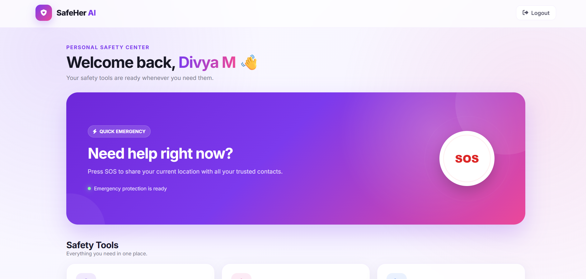
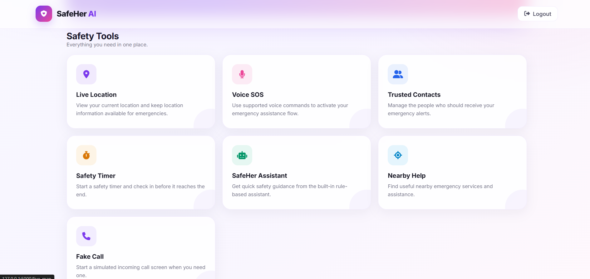
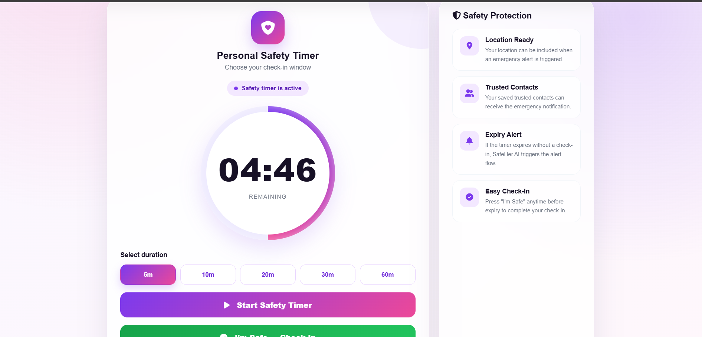

# 🚨 SafeHer AI

### AI-Based Personal Safety Web Application

SafeHer AI is a personal safety web application designed to help users quickly access emergency assistance, share their location, and stay connected with trusted contacts during unsafe situations.

## ✨ Features

- 🚨 Quick SOS
- 🎤 Voice SOS
- 👥 Trusted Emergency Contacts
- 📍 Live Location Sharing
- ⏱️ Safety Timer
- 🤖 Rule-Based SafeHer Assistant
- 🏥 Nearby Help
- 📞 Fake Call
- 📱 Progressive Web App (PWA)

## 🛠️ Technologies Used

- **Frontend:** HTML, CSS, JavaScript
- **Backend:** Python, Flask
- **Database:** SQLite
- **ORM:** Flask-SQLAlchemy
- **Maps & Location:** Browser Geolocation API, Google Maps
- **Voice:** Web Speech Recognition API
- **PWA:** Web App Manifest

## 🚨 Emergency Flow

```text
User activates SOS
        ↓
Location is obtained
        ↓
Emergency contacts are identified
        ↓
SOS alert is sent
        ↓
Google Maps location is shared
```

## 📸 Screenshots

### 🏠 Dashboard


### 🚨 Quick SOS


### ⏱️ Safety Timer


### 🎙️ Voice SOS

